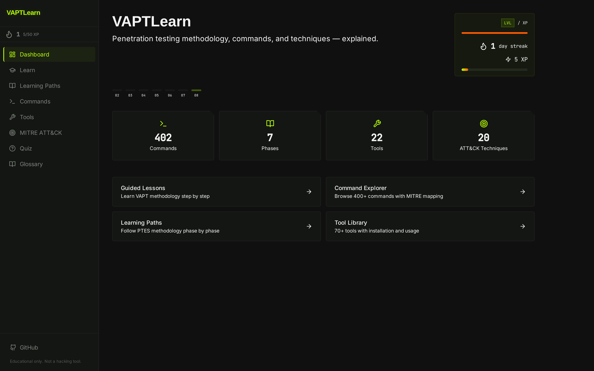
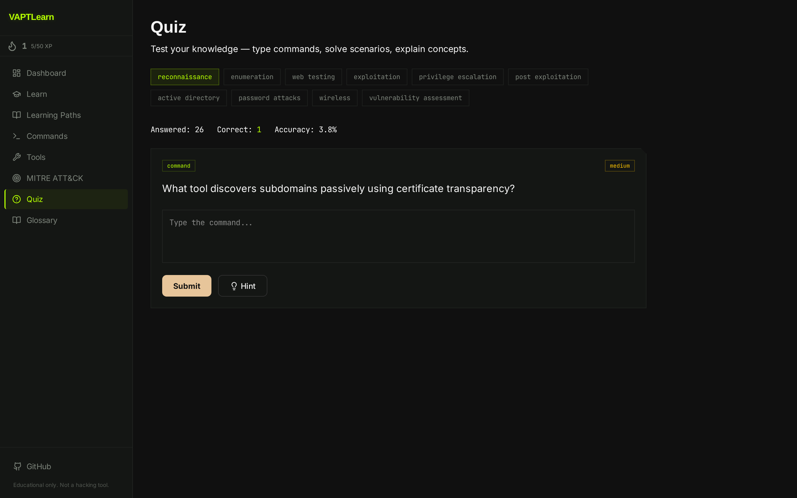
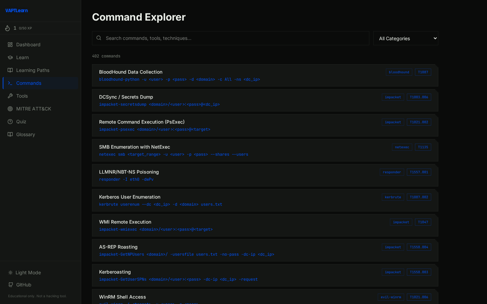
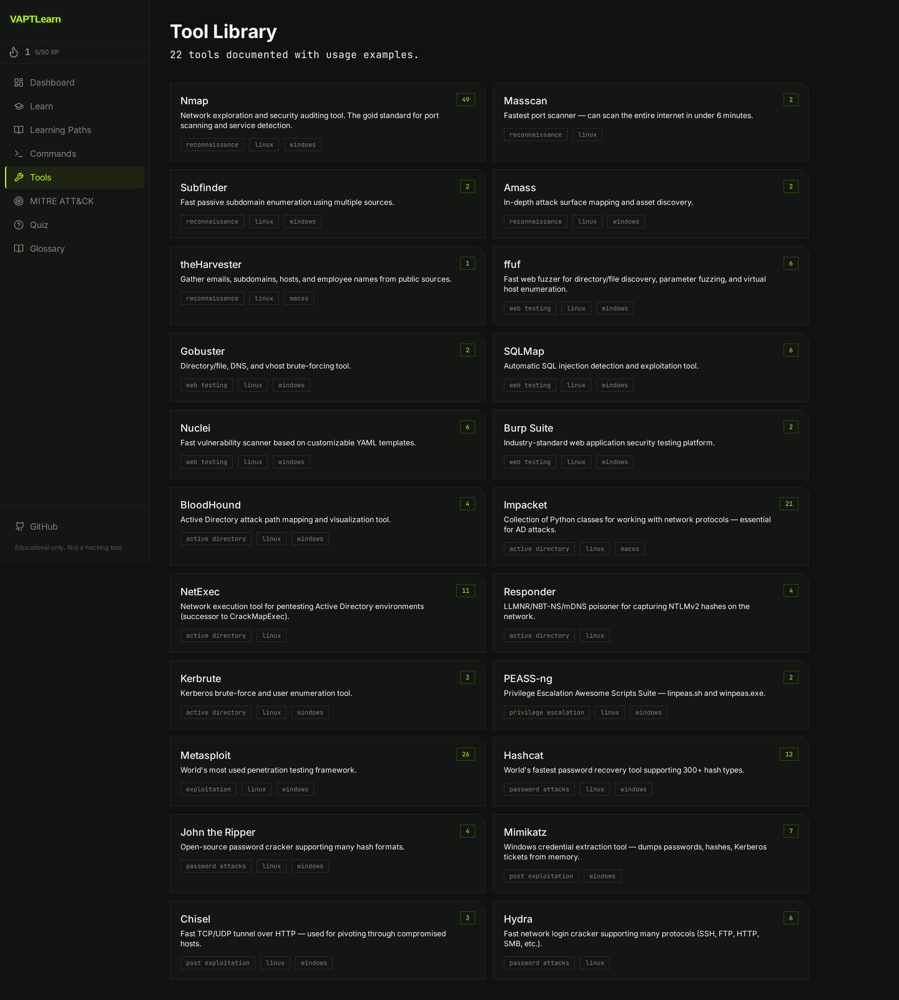
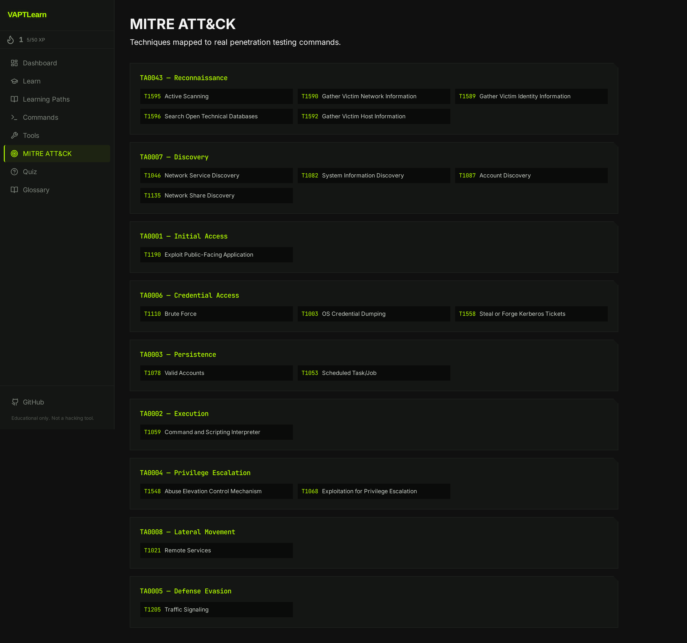

# 🔒 VAPTLearn — Penetration Testing Learning Platform

> **Learn VAPT methodology, commands, and techniques — with MITRE ATT&CK mapping, detection, and remediation.**


---

## What is this?

VAPTLearn is a local-first cybersecurity learning platform that teaches penetration testing through structured methodology. Like TryHackMe/HackTheBox Academy — but runs entirely on your machine, no labs needed.

**For each command, you get:**
- What it does and when to use it
- Arguments explained
- Expected output
- MITRE ATT&CK technique mapping
- How defenders detect it (Blue Team perspective)
- Remediation recommendations
- Common mistakes to avoid
- Alternative tools

---

## 📸 Screenshots

| Dashboard | Guided Lessons |
|:---:|:---:|
|  |  |

| Quiz Engine | Command Explorer |
|:---:|:---:|
|  |  |

| Tool Library | MITRE ATT&CK | Glossary |
|:---:|:---:|:---:|
|  |  |  |

---

## ✨ Features

| Feature | Description |
|---------|-------------|
| 🔍 Command Explorer | 402 commands with search & filter across 53 categories |
| 📖 Guided Lessons | 7 PTES phases with 65 in-depth theory sections |
| 🛠️ Tool Library | 22 tools with installation guides |
| 🎯 MITRE ATT&CK | 200+ techniques mapped to commands |
| 🧠 Quiz Engine | 300 questions across 10 categories with streak/XP |
| 📖 VAPT Glossary | 213 searchable cybersecurity terms |
| 🏆 Level System | 10 levels with XP progression (separate from streak) |
| 🔖 Progress Tracking | Mark commands & lessons as completed |
| 🔖 Bookmarks & Notes | Personal reference system |
| 🎨 Lamborghini Identity | Carbon fiber + Venom Green + Arancio Orange theme |

---

## 📊 Platform Stats

| Metric | Count |
|--------|-------|
| Commands | 402 |
| Command Data Files | 53 |
| Tools | 22 |
| Theory Phases | 7 |
| Theory Sections | 65 |
| Quiz Questions | 300 |
| Quiz Categories | 10 |
| Glossary Terms | 213 |
| Max Level | 10 |
| Automated Tests | 42 |

---

## 🚀 Quick Start

### Prerequisites
- Python 3.10+
- Node.js 18+
- npm

### Installation

```bash
# Clone the repository
git clone https://github.com/Yash-Patil-1/VAPTLearn.git
cd VAPTLearn

# Option A: Automated setup
chmod +x setup.sh
./setup.sh

# Option B: Manual setup
# Backend setup
cd backend
python3 -m venv .venv
source .venv/bin/activate
pip install -r requirements.txt

# Frontend setup
cd ../frontend
npm install
```

### Running the Application

```bash
# Terminal 1 — Backend
cd backend
source .venv/bin/activate
uvicorn main:app --reload --port 8000

# Terminal 2 — Frontend
cd frontend
npm run dev
```

Open **http://localhost:5173**

---

## 🏗️ Tech Stack

| Layer | Technology |
|-------|-----------|
| Frontend | React 18, Vite, Tailwind CSS v4 |
| Backend | FastAPI, Python 3.10+ |
| Database | SQLite (progress, streaks, XP, daily activity) |
| Knowledge Base | JSON (commands, tools, theory, questions, glossary) |
| Design | Lamborghini — carbon black + Venom Green (#B4FF00) + Arancio Orange (#FF5C00) |

---

## 🔌 API Endpoints

| Method | Endpoint | Description |
|--------|----------|-------------|
| GET | `/` | Platform info |
| GET | `/health` | Health check |
| GET | `/api/commands` | List all commands (with search/filter) |
| GET | `/api/commands/{id}` | Get command details |
| GET | `/api/phases` | List PTES phases |
| GET | `/api/tools` | List all tools |
| GET | `/api/mitre` | MITRE ATT&CK techniques |
| GET | `/api/mitre/tactics` | MITRE tactics |
| GET | `/api/lessons` | List guided lessons (7 phases) |
| GET | `/api/lessons/{id}` | Get lesson with sections + checkpoints |
| POST | `/api/lessons/{id}/complete` | Complete lesson & award XP |
| GET | `/api/quiz/next` | Get next quiz question |
| POST | `/api/quiz/answer` | Submit quiz answer |
| GET | `/api/quiz/stats` | Quiz performance stats |
| GET | `/api/streak` | Get streak, XP, level, daily activity |
| GET | `/api/glossary` | List all glossary terms |
| GET | `/api/glossary/search?q=` | Search glossary |
| GET | `/api/glossary/count` | Glossary term count |
| POST | `/api/progress/mark` | Mark command as learned |
| GET | `/api/progress` | Get learning progress |

---

## 📁 Project Structure

```
VAPTLearn/
├── backend/
│   ├── main.py                       # FastAPI application
│   ├── requirements.txt              # Python dependencies
│   ├── data/
│   │   ├── commands/                 # Command JSON files (402 commands, 53 files)
│   │   ├── theory/                   # Learning content (7 phases, 65 sections)
│   │   ├── questions/                # Quiz questions (300 across 10 categories)
│   │   ├── glossary.json             # 213 VAPT terms
│   │   ├── tools.json                # Tool definitions (22 tools)
│   │   ├── phases.json               # PTES phase definitions
│   │   ├── mitre_techniques.json     # MITRE ATT&CK techniques
│   │   └── domains.json              # Category domains
│   ├── models/
│   │   ├── database.py               # SQLite init + connection
│   │   └── schemas.py                # Pydantic models
│   ├── routers/
│   │   ├── commands.py, phases.py, tools.py, mitre.py
│   │   ├── quiz.py, lessons.py, progress.py
│   │   ├── streak.py, glossary.py
│   ├── services/
│   │   ├── knowledge_base.py         # JSON data loader
│   │   ├── quiz_engine.py            # Quiz logic + validation
│   │   └── stats.py                  # XP, level, streak calculations
│   ├── scripts/                      # Data generation scripts
│   └── tests/                        # 42 automated tests
├── frontend/
│   ├── src/
│   │   ├── components/               # Reusable React components
│   │   ├── pages/                    # 12 page views
│   │   ├── styles/globals.css        # Tailwind v4 + theme
│   │   ├── App.jsx                   # Router setup
│   │   └── main.jsx                  # Entry point
│   ├── index.html
│   ├── package.json
│   └── vite.config.js
├── .vscode/settings.json             # VS Code Tailwind config
├── data/database/                    # SQLite database (auto-created)
├── docs/                             # Design documentation
├── .gitignore
├── LICENSE
└── README.md
```

---

## 🧪 Testing

```bash
cd backend
source .venv/bin/activate
python -m pytest tests/ -v
```

**42 tests passing** — knowledge base integrity, API endpoints, search, filters, progress tracking, quiz engine, lesson system, streak/XP calculations.

---

## 📖 Content Coverage

| Category | Description |
|----------|-------------|
| Chapter | Sections | Description |
|---------|----------|-------------|
| Reconnaissance | 11 | OSINT, subdomain enumeration, Shodan, ASN mapping, recon automation |
| Enumeration | 10 | Service enum, SMB, SNMP, LDAP, DNS, database, cloud services |
| Vulnerability | 9 | Nmap NSE, CVE research, fuzzing, race conditions |
| Exploitation | 10 | SQLi, file upload RCE, SSRF, Metasploit, container escape, C2 |
| Privilege Escalation | 9 | Linux/Windows privesc, kernel exploits, cloud/K8s privesc |
| Post-Exploitation | 9 | Credential dumping, pivoting, AD CS, persistence, cloud post-ex |
| Reporting | 7 | Documentation, evidence collection, report QA, metrics |

**Quiz categories (300 questions):** Reconnaissance, Enumeration, Web Testing, Exploitation, Vulnerability Assessment, Privilege Escalation, Post-Exploitation, Active Directory, Password Attacks, Wireless

---

## 🎨 Design

**Lamborghini-inspired design language:**
- Carbon black (`#0A0B0A`) background — dark, aggressive, high-performance
- Forged panel (`#141614`) for cards — angular clip paths, carbon-fiber aesthetic
- Venom Green (`#B4FF00`) accents — neon, energetic, high-contrast
- Arancio Orange (`#FF5C00`) for highlights — heat, power, warning
- JetBrains Mono + Rajdhani for typography
- No border-radius — all angular, industrial, mechanical

---

## 🔒 Important

This is an **educational platform**. It does NOT:
- Execute attacks against unauthorized targets
- Provide vulnerable labs
- Automate exploitation
- Use external AI APIs
- Require cloud or VMs

It teaches methodology, explains commands, reinforces learning through active-recall quizzes, and builds real understanding. Everything runs locally.

---

## 👤 Author

**Yash Patil** — B.Tech IT | CEH  
🌐 [yashpatil.online](https://www.yashpatil.online/) · 🐙 [GitHub](https://github.com/Yash-Patil-1) · 💼 [LinkedIn](https://www.linkedin.com/in/yash-patil-997357330/)

---

## 📄 License

This project is licensed under the MIT License — see the [LICENSE](LICENSE) file for details.
